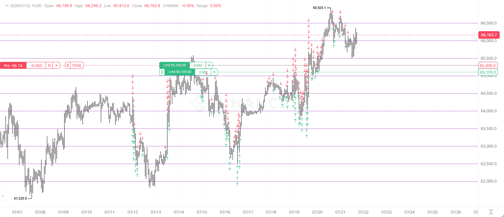
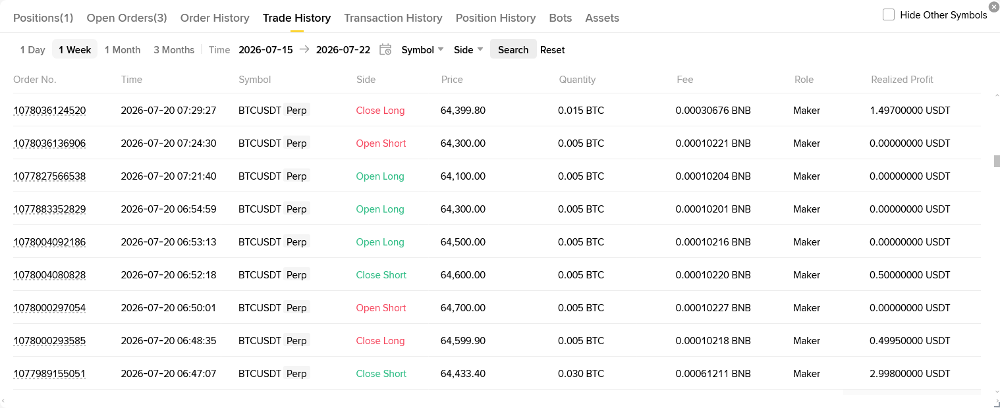
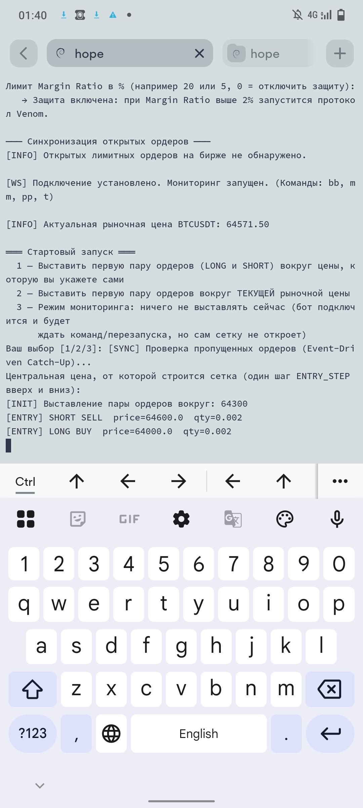
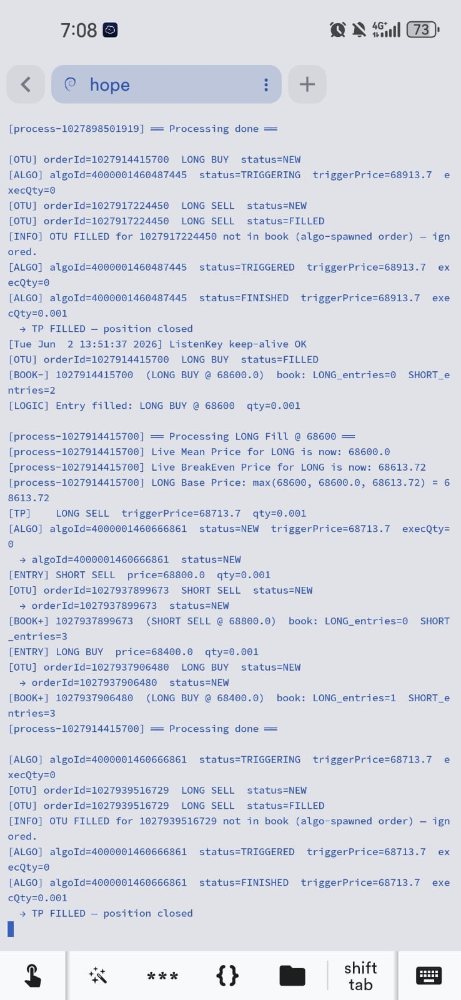

# 📈 Algorithmic Trading Architecture: Binance Futures Grid Bot

> **Notice:** This repository serves as a **Technical Case Study**. The actual source code is proprietary and kept in a private repository to protect the underlying trading algorithms, custom risk management math, and financial logic.

## 📌 High-Level Overview

This project showcases the architecture and development of an autonomous, high-frequency grid trading bot designed for the **Binance USDT-M Futures** market. The core objective was to build an "invincible", set-and-forget algorithmic system capable of executing dynamic grid strategies while mathematically eliminating the risk of liquidation through a proprietary event-driven safety mechanism.

This system demonstrates advanced backend automation, handling of complex WebSocket data streams, mitigation of thread race conditions, and precision floating-point arithmetic.

---

## ⚙️ Core Technical Features

- **Custom Lightweight API Client:** Built from scratch without heavy dependencies (no `python-binance` or `pandas`), utilizing raw `requests` and `hmac` SHA-256 signatures for minimal execution latency.
- **Event-Driven Execution & Catch-Up Sync:** Uses a continuous WebSocket stream (`ORDER_TRADE_UPDATE`) for zero-lag reactions. Includes a custom retrospective sync mechanism (`sync_orders`) that cross-references REST API open orders with internal RAM state to safely recover and process missed fills if the connection drops.
- **Margin Protection Protocol:** A proprietary risk management engine. If the account Margin Ratio exceeds a critical threshold, the bot automatically freezes the losing side, sets a mathematical escape Take-Profit, and initiates a "single-sided capped grid" on the safe side to extract volatility profits until the danger is resolved.
- **Strict Decimal Precision:** Replaces all floating-point math with Python's `Decimal` module (precision 18) to prevent rounding errors during Take-Profit and other calculations.
- **Thread-Safe Memory Management:** Utilizes `threading.Lock()` to prevent data race conditions when modifying the internal order book (`INTERNAL_ORDER_BOOK`) or emergency tracking sets across concurrent WebSocket and REST API threads.
- **Live Command Terminal:** Features an asynchronous keyboard listener allowing the operator to send hot-commands (e.g., emergency breakeven closure, VWAP merging, instant profit taking) without interrupting the main trading loop.

---

## 🛠 Technical Stack

| Component | Technology / Library |
| :--- | :--- |
| **Core Language** | Python 3.x |
| **Exchange Integration** | Custom REST API Client, `websocket-client` |
| **Data Processing** | `decimal` (Strict Math), `json` |
| **Architecture** | Multi-threaded, Event-Driven, Asynchronous |
| **Deployment** | Linux VPS (`screen`) |

---

## 📊 System Architecture & Logic Flow

1. **Market Stream:** The WebSocket permanently listens for physical order executions on the exchange, ignoring redundant market noise.
2. **Grid Engine (Safer/Blackhole):** Upon a fill, the bot spawns new entry orders based on what the user choose: only at the profitale side of currently open postition\s or around a filled order everytime.
3. **TP Engine (Grid/Whole Position/Every Lot):** Upon a fill, the bot requests the VWAP and Break-Even price (`compute_safe_tp_anchor`) (for the Grid and Whole modes) and spawns new dynamic limit TP orders based on user-defined mode.
4. **Risk Monitor:** Before opening new positions, the bot queries the account Margin Ratio. If the threshold (e.g., 5%) is breached, standard trading halts.
5. **Margin Ratio Limit Recovery Engine:** The bot calculates the exact volume of the losing side and uses it as a hard cap (`VENOM_MAX_CAP`). It then aggressively scalps the market in the opposite direction, strictly replacing 1 lot at a time, bleeding market volatility to offset the floating loss.
6. **Seamless Reversion:** Once the losing side hits its recovery target, the Insurance Protocol deactivates, clears the board, and seamlessly restarts the standard grid centered around the current market price.

---

## 🖼 Visual Showcase

  <!-- Первое горизонтальное изображение -->
  
   
  <i>The bot at the state of margin ratio limit trading pause (Insurance Protocol).</i>

     

  <!-- Второе горизонтальное изображение -->
  
   
  <i>Automated trade execution history on Binance Futures (attention to the "Side" column, 0 Profit means it's an open lot trade).</i>

     

  <!-- Два вертикальных изображения рядом -->
  <table>
    <tr>
      <td align="center">
        
         
        <i>System initialization and WebSocket connection handling.</i>
      </td>
      <td align="center">
        
         
        <i>The trading process of the bot in the terminal window.</i>
      </td>
    </tr>
  </table>

 

---

## 💡 Engineering Takeaway

Developing this autonomous system required strict attention to detail—a single unhandled exception, network desync, or floating-point rounding error could result in severe financial loss or account liquidation. Architecting the **Margin Ratio Insurance Protocol** and the **TP\Grid Engines** bridges the gap between pure code and chaotic live-market behavior.

This experience heavily translates into any industry requiring **high-stakes data automation, concurrent thread safety, network resilience, and 24/7 backend reliability** (such as FinTech, High-Frequency Trading, and complex API integrations, for example Agricultural Tech programming).
